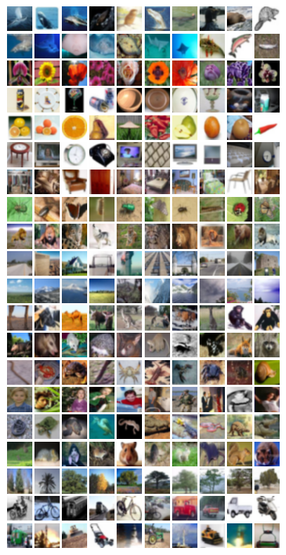
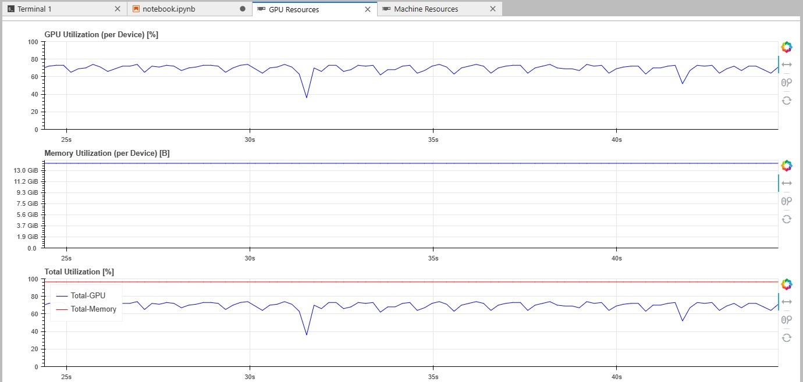
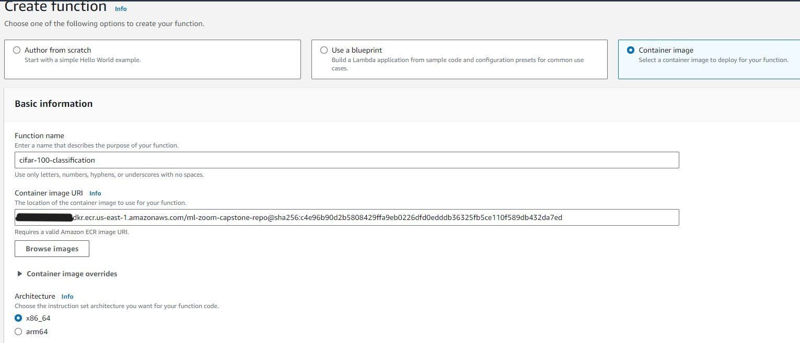
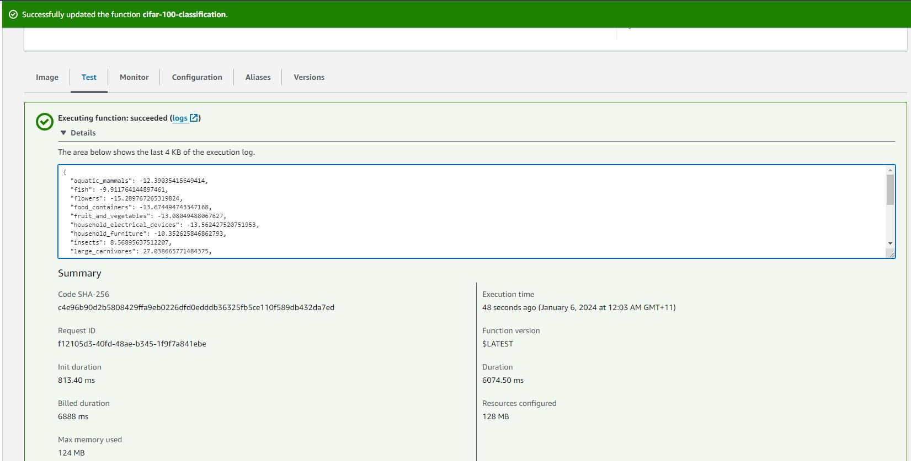
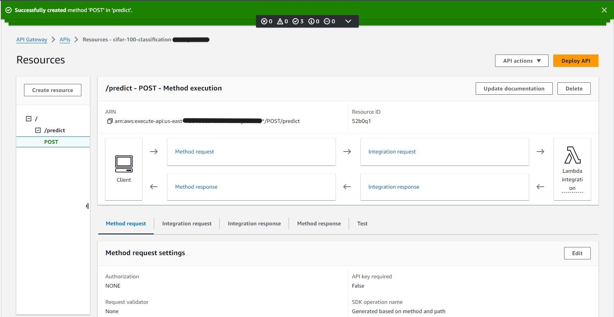
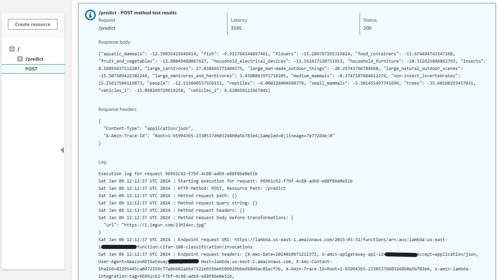
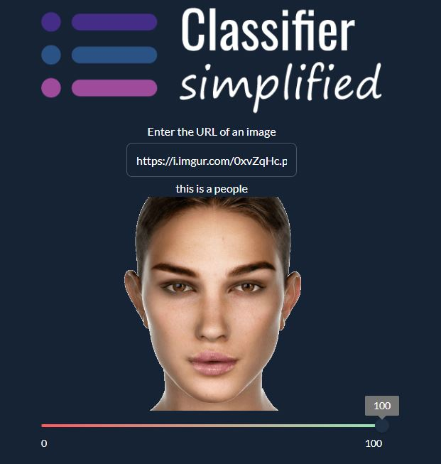
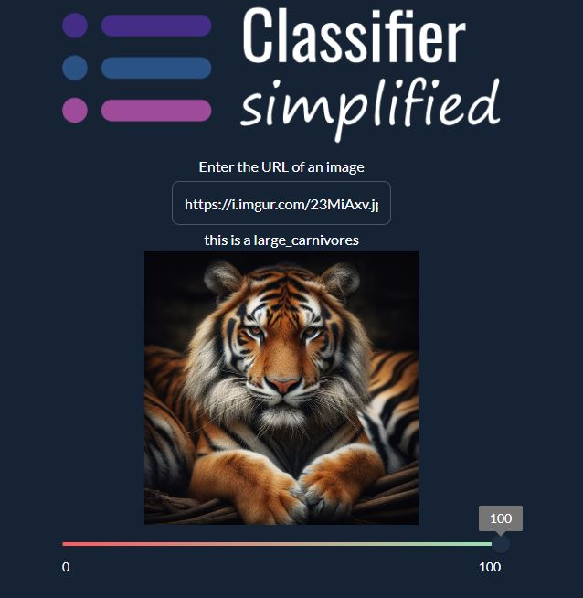

# CIFAR-100 Image Classification

<p align="center">
  
</p>

<!-- TABLE OF CONTENTS -->
## Table of Contents

* [Problem Statement](#Problem-Statement)
* [Dataset](#Dataset)
* [Project Structure](#Project-Structure)
* [Getting Started](#Getting-Started)
    * [Prerequisites](#Prerequisites)
    * [Installation](#Installation)
* [Data Pre-processing](#Data-Pre-processing)
* [EDA](#EDA)
* [Training the Model](#training-the-Model)
* [Serving the Model](#serving-the-Model)
* [Docker Setup](#Docker-Setup)
* [AWS Lambda](#AWS-Lambda)
* [AWS API Gateway](#AWS-API-Gateway)
* [Taipy Web Application](#Taipy-Web-Application)

## Problem Statement

This project aims to classify images into one of 20 categories, such as aquatic mammals, flowers, insects, vehicles, etc. The images are taken from the [CIFAR-100 dataset](https://paperswithcode.com/dataset/cifar-100), which is a subset of the Tiny Images dataset and consists of 60,000 32x32 color images in 100 different classes. Each class has 600 images, with 500 for training and 100 for testing. The 100 classes are grouped into 20 superclasses, each with 5 subclasses. Each image has a "fine" label (the subclass to which it belongs) and a "coarse" label (the superclass to which it belongs).

To solve this problem, we propose to use a deep convolutional neural network (CNN) that can learn hierarchical features from the raw pixel values of the images. We will use pre-trained model architectures that have been trained on a large-scale image dataset, such as [DenseNet](https://www.tensorflow.org/api_docs/python/tf/keras/applications/densenet) and others, and fine-tune them on the CIFAR-100 dataset. We will also apply various data preparation, cleaning, EDA, model hyperparameter tuning, regularization, model selection, and data augmentation techniques to increase the robustness and generalization of the final model. For simplicity, we will consider only the 20 "coarse" labels when we train and evaluate our models, rather than the 100 "fine" labels. This will reduce the number of output classes and make the task more manageable.

## Dataset

- The original raw CIFAR-100 dataset is publicly and freely available to [download](https://www.cs.toronto.edu/~kriz/cifar.html). 

- A random subset of the pre-processed dataset is available to download from the [data](data/clean-cifar-100-python/) folder of this repo. 


## Project Structure

```
root/
├── README.md                         # Project documentation
├── data                           
│   └── clean-cifar-100-python        # Data assets
│       ├── test                      # Pre-processed sample data for model testing
│       │   ├── data.npy
│       │   └── labels.npy
│       ├── test-deployment           # Pre-processed sample data for deployment testing
│       │   ├── image_0.jpg
│       │   ├── image_1.jpg
│       │   ├── image_2.jpg
│       │   └── labels.npy
│       ├── train                     # Pre-processed sample data for model training
│       │   ├── data.npy
│       │   └── labels.npy
│       └── validate                  # Pre-processed sample data for model validation
│           ├── data.npy
│           └── labels.npy
├── deploy                            # Model deployment assets
│   ├── Dockerfile                    # Dockerfile for container setup
│   ├── cifar-100-model.tflite        # Converted TensorFlow Lite model
│   ├── convert_and_test.ipynb        # Notebook to convert and test Lite model
│   ├── create_test_deployment_data.ipynb     # Notebook to sample images for deployment testing
│   ├── lambda_function.py            # Script for model serving to use remotely in AWS Lambda
│   ├── lambda_function_local.py      # Script for model serving to use locally (localhost)
│   ├── test_api_gateway.py           # Script to test Web service deployed in AWS API Gateway
│   ├── test_docker.py                # Script to test Web service deployed in Docker container
│   └── test_local.py                 # Script to test model serving in lambda_function_local.py
├── jupyter                           # EDA + ML assets
│   ├── notebook.ipynb                # Data Pre-processing, EDA, and Model training (sample data)
│   ├── notebook_all.ipynb            # Data Pre-processing, EDA, and Model training (all data)
│   ├── notebook_all_augment.ipynb    # Data Pre-processing, EDA, and Model training (augmented data)
│   └── train.py                      # Final model training script
├── model                             # Model assets
│   ├── densenet121_v1_34_0.592.h5    # Keras model 1 (59.2% validation accuracy)
│   └── densenet121_v1_38_0.515.h5    # Keras model 2 (51.5% validation accuracy)
├── requirements.txt                  # Development dependencies
└── webapp                            # Web application assets
    ├── logo.png
    ├── main.py                       # Web app main script
    ├── placeholder_image.png
    └── requirements.txt              # Web app dependencies

```
## Getting Started

### Prerequisites

- Programming language: Python
    ```Python 3.10.6 ```    

- Dependencies:

| Library | Dev Environment  | Model Deployment| Web Application |
|---------|------------------|-----------------|-----------------|
|         |                  |                 |                 | 
| jupyter |   X   |        |        |
| jupyter_contrib_nbextensions |  X    |        |        |
| notebook==6.4.12 |   X   |        |        |
| traitlets==5.9.0 |   X   |        |        |
| numpy |   X   |   X    |    X    |
| pandas |  X   |        |        |
| requests |  X  |  X    |   X    |
| tensorflow-cpu==2.11.1 |   X   |        |        |
| tflite_runtime-2.14    |       |   X    |        |
| keras-image-helper |      |        |        |
| pillow |  X   |    X   |    X    |
| tensorflow-serving-api==2.7.0 |      |        |        |
| matplotlib |   X   |        |        |
| scikit-learn |   X   |        |        |
| awscli |      |   X     |        |
| taipy |      |        |    X    |

### Installation

1. Clone the Repository

   ```bash   
   git clone https://github.com/anammari/machine-learning-zoomcamp-capstone-2023.git
   cd machine-learning-zoomcamp-capstone-2023
   ```

2. Set Up a Virtual Environment

    ```bash
    python -m venv myenv
    ```
3. Activate the Virtual Environment
    
    ```bash
    source myenv/bin/activate
    ```

4. Install the dependencies
    
    ```bash
    pip install -r requirements.txt
    ```

5. Launch Jupyter
    
    ```bash
    jupyter notebook
    ```

## Data Pre-processing

The following logic has been implemented in all the notebooks in the `jupyter/*` folder.

1. **Reshape the data**: The image data in the CIFAR-100 dataset is stored as 1D arrays. We want to reshape it into 3D arrays (32x32x3) for easier processing and analysis.

2. **Resize the data**: The image data in the CIFAR-100 dataset is 32x32. To be able to use transfer learning using common pretrained models, the image data has to be resized to a minimum of 75x75.

3. **Normalize the data**: The pixel values of the images are in the range [0, 255]. We want to normalize these values to the range [0, 1] for better performance of the machine learning models.

4. **Consider only the coarse labels**: For simplicity, We can consider only the 20 "coarse" labels (superclasses) rather than the 100 "fine" labels (classes) when We train multi-class image classifiers for this dataset. This means We would use `coarse_labels` instead of `fine_labels` in our code.

5. **One-hot encode the labels**: The labels are currently integers representing the class of each image. We want to one-hot encode these labels for multi-class classification tasks.

6. **Split the data**: The CIFAR-100 dataset comes with predefined train and test sets. We want to further split the train set into a validation set for tuning the hyperparameters of our models.

## EDA

The following logic has been implemented in all the notebooks in the `jupyter/*` folder.

1. **Visualize the images**: Display some sample images from each class to get a sense of what the images look like.

2. **Class distribution**: Check the distribution of the classes in the train and test sets. If the classes are imbalanced, We need to take this into account when training our models.

## Training the Model

### Training Logic

The following logic has been implemented in all the notebooks in the `jupyter/*` folder.

1. **Choose a model architecture**: For image classification tasks, convolutional neural networks (CNNs) are usually a good choice. We want to experiment with three different architectures (Xception, ResNet50, DenseNet121) to see which one works best for this dataset.

2. **Hyperparameter tuning**: Tune the hyperparameters of our model (learning rate, batch size, number of layers) to optimize its performance.

3. **Regularization**: To prevent overfitting, We want to use regularization techniques like dropout.

4. **Model training**: Train our model using the train set and monitor its performance on the validation set. We can use techniques like early stopping to prevent overfitting.

5. **Model evaluation**: Evaluate the performance of our model on the test set using appropriate metrics (e.g., accuracy, precision, recall, F1 score).

### Training Process

1. Download the [CIFAR-100 dataset](https://paperswithcode.com/dataset/cifar-100). 

2. Create a folder `data/cifar-100-python` and place the downloaded data into three subfolders (meta, train, test). 

3. Run `train.py` to prepare the data, perform EDA, train, select, and persist the models 

```bash
cd jupyter && python train.py
```

### GPU & Memory Utilization (on Saturn Cloud)

<p align="center">
  
</p>

### Model Selection

The best performing model has the following specifications:

- Training data proportion: 100%

- Data augmentation: Disabled 

- Validation accuracy: 59.2%

- Last epoch reached: 34

- Pre-trained model architecture: DenseNet-121

## Serving the Model

1. Run `deploy/create_test_deployment_data.ipynb` to create a random sample of images for deployment testing.  

2. Run `deploy/convert_and_test.ipynb` to convert the Keras model to Lite and test with sample images.

3. Run `deploy/test_local.py` to test model inference

```bash
cd deploy && python test_local.py
```
out:
```python
{'aquatic_mammals': -12.39035415649414, 'fish': -9.911764144897461, 'flowers': -15.289767265319824, 'food_containers': -13.674494743347168, 'fruit_and_vegetables': -13.08049488067627, 'household_electrical_devices': -13.562427520751953, 'household_furniture': -10.352625846862793, 'insects': 8.56895637512207, 'large_carnivores': 27.038665771484375, 'large_man-made_outdoor_things': -20.29743766784668, 'large_natural_outdoor_scenes': -15.307509422302246, 'large_omnivores_and_herbivores': 3.4560863971710205, 'medium_mammals': -0.3747107684612274, 'non-insect_invertebrates': 15.25617504119873, 'people': -12.515860557556152, 'reptiles': -6.000228404998779, 'small_mammals': -5.301455497741699, 'trees': -35.60188293457031, 'vehicles_1': -15.068269729614258, 'vehicles_2': 4.610659122467041}
```

## Docker Setup 

1. Build the docker image locally
```bash
cd deploy && docker build -t ml-zoom-capstone .
```

2. Run the docker container
```bash
docker run -p 9000:8080 -it ml-zoom-capstone
```

3. Run `deploy/test_docker.py` to test containerized model inference
```bash
cd deploy && python test_docker.py
```
out:
same out of running `deploy/test_local.py` above

## AWS Lambda

1. Create remote repository in AWS Elastic Container Registry
```bash
aws ecr create-repository --repository-name ml-zoom-capstone-repo
```

2. Log in to repository
```bash
$(aws ecr get-login --no-include-email)
```

3. Tag the local Docker image
```bash
ACCOUNT=XXX
REGION=XXX
REGISTRY=ml-zoom-capstone-repo
PREFIX=${ACCOUNT}.dkr.ecr.${REGION}.amazonaws.com/${REGISTRY}
TAG=cifar-100-densenet-v1-592
REMOTE_URI=${PREFIX}:${TAG}
docker tag ml-zoom-capstone:latest ${REMOTE_URI}
```

4. Push the local Docker image to AWS ECR
```bash
docker push ${REMOTE_URI}
```

5. Create AWS Lambda function

<p align="center">
  
</p>

6. Test AWS Lambda function

<p align="center">
  
</p>

## AWS API Gateway

1. Create `/predict` POST method in AWS API Gateway

<p align="center">
  
</p>

2. Test `/predict` POST method in AWS API Gateway

<p align="center">
  
</p>

3. Run `deploy/test_api_gateway.py` to test model inference on AWS

```bash
cd deploy && python test_api_gateway.py
```
out:
same out of running `deploy/test_local.py` above

## Taipy Web Application

A [Web application](https://cifar-classifier-01.taipy.cloud/) has been developed on [Taipy Cloud](https://cloud.taipy.io/cloud/) to classify images using the deployed model.  

<p align="center">
  
  
</p>

The Web app source code is available in `webapp/main.py`

_Note:_ Machines on Taipy Cloud stop after 2 hours daily. Please [email](ammariect@gmail.com) me if you would like to use the Web app and I will restart it.


